# Barkit – UI/UX Case Study

## 📱 Overview

Barkit is a mobile app designed to assist pet owners during emergency situations involving their dogs. It provides first-aid guidance, helps locate nearby veterinary hospitals, and includes AI-powered and social features for support and interaction.

## 🎯 Problem Statement

Pet owners often face panic and confusion during emergency situations, lacking immediate access to reliable first-aid guidance, nearby veterinary support, and quick assistance.

## 💡 Solution

Barkit offers a centralized platform with AI-assisted support, step-by-step first-aid guidance, a hospital locator with map integration, and a social feed to help users stay informed and connected during emergencies.

---

## 🎯 Key Features

* AI chat support for emergency guidance
* First-aid assistance for dogs
* Nearby veterinary hospital finder with map
* Social feed for sharing and interaction
* User profile management

---

## 🖼️ Core Screens

### Home Screen

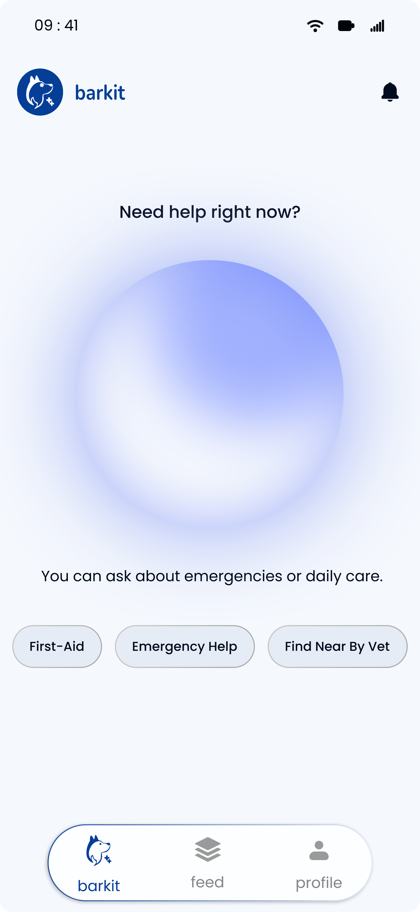  
Provides quick access to emergency features, AI chat, and feed.

### AI

  
Highlights AI-powered assistance features.

### AI Chat

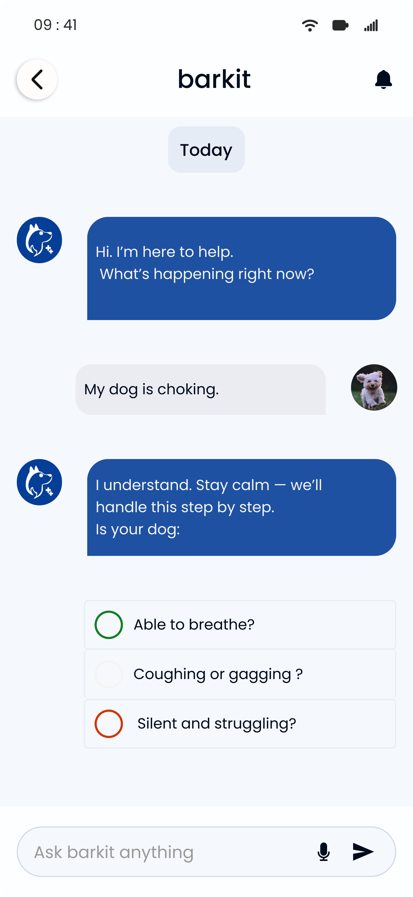  
Allows users to get instant guidance during emergencies.

### Feed

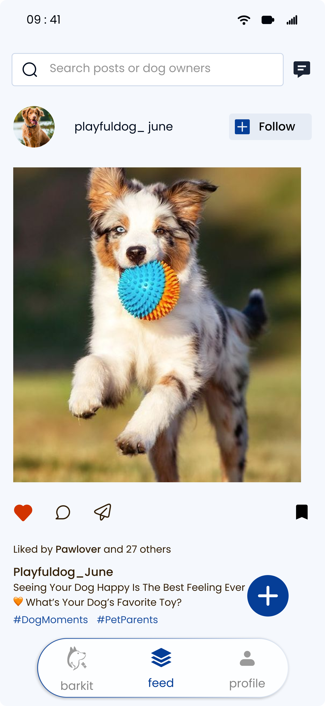  
Displays posts and updates from other pet owners.

### Profile

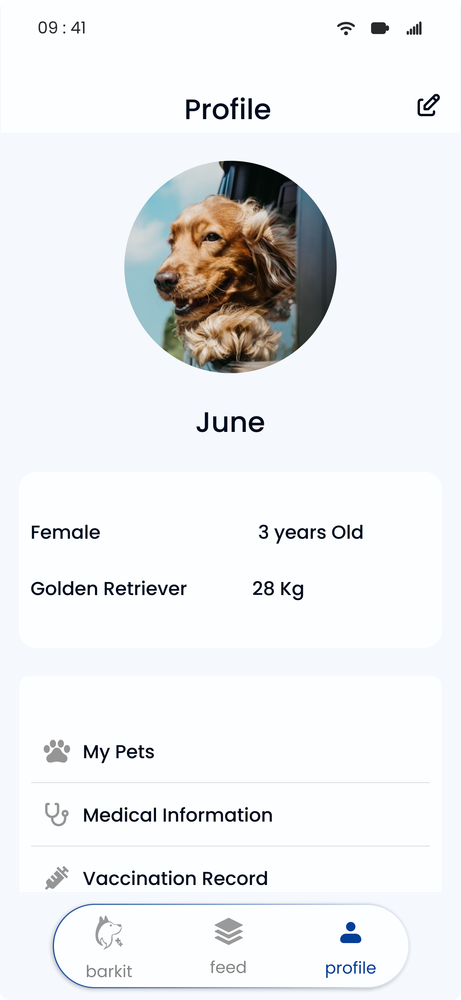  
Shows user details and activity.

---

## 🚨 Emergency & Services

### Find the Vet

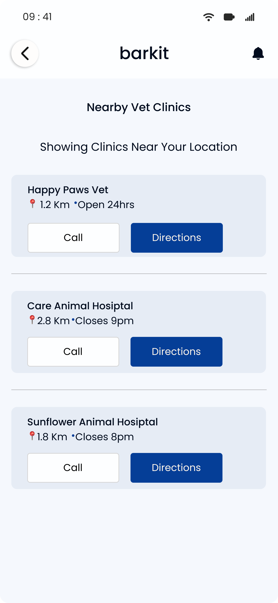  
Helps users locate nearby veterinary hospitals.

### Map View

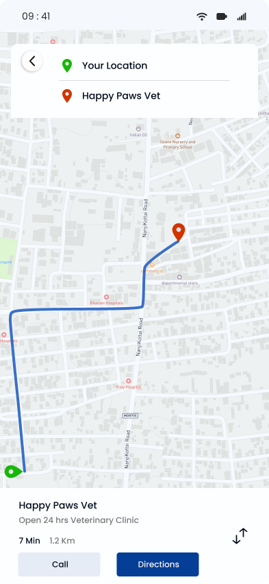  
Displays vet locations on a map for easy navigation.

---

## 📢 Social Features

### Feed Post

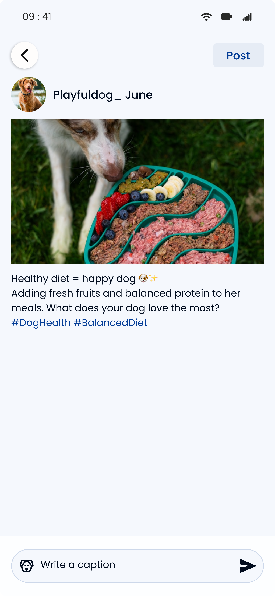  
Allows users to create and share posts.

### Feed Profile

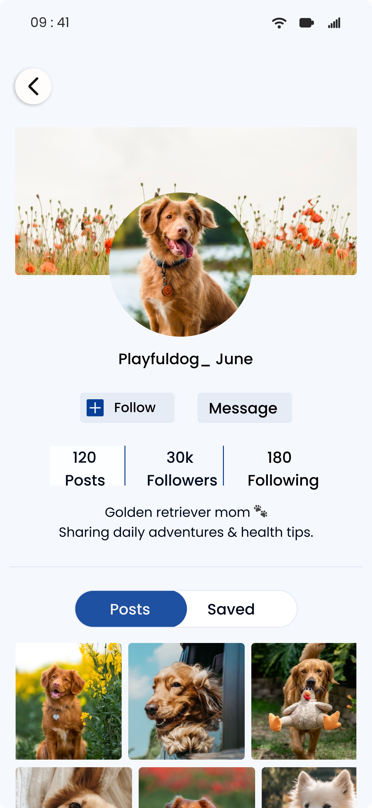  
Displays user-specific posts and interactions.

---

## 🔐 Authentication Flow

### Splash Screen

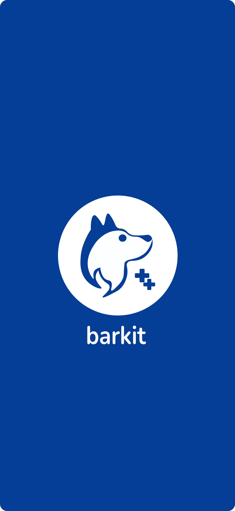

### Login

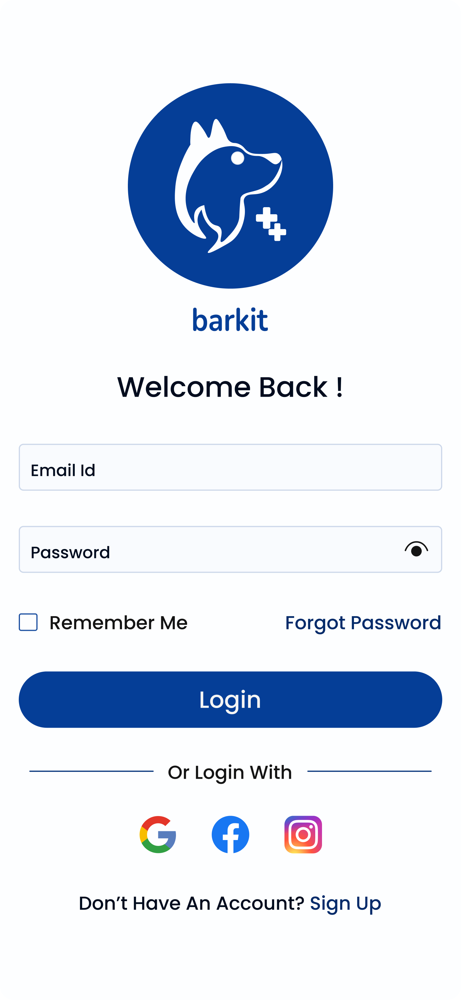

### Signup

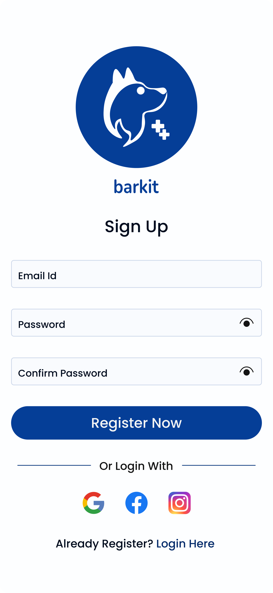

### Forgot Password

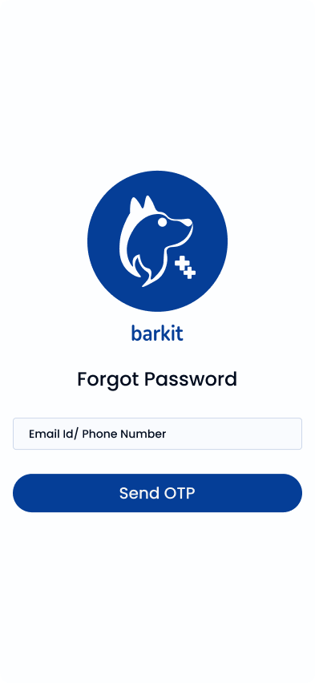

### Verify OTP

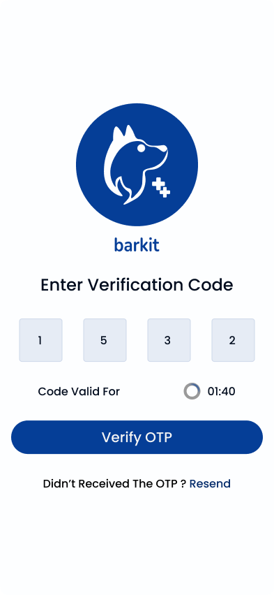

---

## 🚀 Future Improvements

* Real-time emergency alerts
* Advanced AI-based assistance
* Integration with veterinary services
* Enhanced social interaction features

